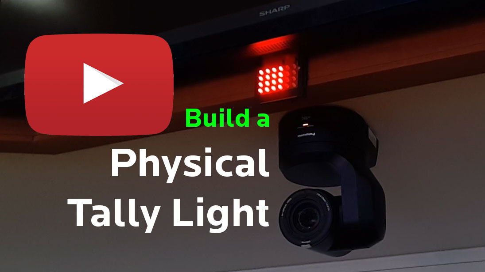

# Tally with ESP32
* Build physical Broadcast Tally Lights with the [ESP32](https://www.espressif.com/en/products/socs/esp32) microcontroller.
* This is a companion / extension project of the [Tally system](http://github.com/jowe81/tally) and needs a functional instance of that project to work.
* Use the [Arduino](https://www.arduino.cc/) platform with the [ESP32 drivers](https://randomnerdtutorials.com/installing-the-esp32-board-in-arduino-ide-windows-instructions/) to upload Arduino projects to the ESP chip.
* To clone the sketch, navigate to your Arduino directory and type ```git clone http://github.com/jowe81/tally_esp32```.

## Watch Demo Video:
[](https://www.youtube.com/watch?v=Li7S9GSyH2o)

## About
I work as a technical director at [Tenth Church](http://www.tenth.ca) in Vancouver, Canada. We recently installed a broadcast video system and were looking to get a tally system. But instead of buying one, we made one. Read more about the project [here](http://github.com/jowe81/tally).